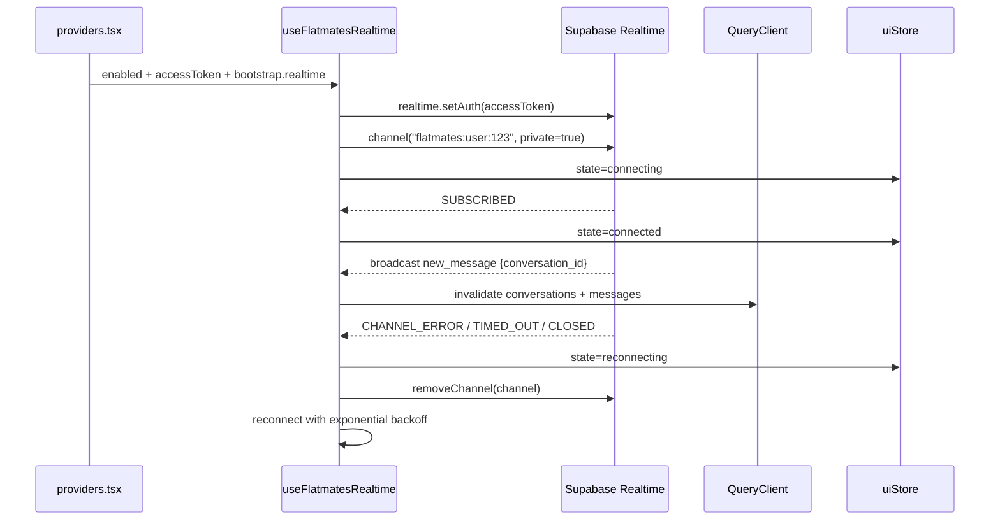

# Real-time updates

Active contributors: Saksham

Real-time updates keep chats, notifications, visits, matches, and listing status in sync without polling. The web app now uses Supabase Realtime private Broadcast channels supplied by `GET /flatmates/bootstrap`. The backend publishes a small event envelope to the authenticated user's channel, the client subscribes with the current Supabase access token, and the hook invalidates the affected TanStack Query keys so each screen refetches the authoritative record. For how messages consume this transport, see [Messaging](messaging.md). For visits, see [Visits](visits.md). For the bearer-token flow, see [API client](../systems/api-client.md).

## Bootstrap contract

`FlatmatesBootstrap.realtime` is the transport contract:

```ts
interface FlatmatesRealtimeConfig {
  provider: "supabase";
  channel: string;      // e.g. "flatmates:user:123"
  private: boolean;     // true for private Realtime authorization
  events: string[];     // backend Broadcast events to subscribe to
}
```

`src/providers.tsx` reads this config with the shared `bootstrapOptions` query after the user is authenticated and the backend auth stage is `active`. Missing config means no realtime connection is opened; normal query stale-time behavior still applies.

## The six event types

The backend Broadcast event set is intentionally small:

| Event type | Invalidates | Used by |
| --- | --- | --- |
| `new_match` | `["swipes", "deck"]`, `["matches"]`, `["incoming-likes"]`, `["outgoing-likes"]`, `["conversations"]` | Likes, matches, chat list |
| `new_message` | `["conversations"]`, plus `["conversations", id]` and `["conversations", id, "messages"]` when `conversation_id` is present | [Messaging](messaging.md) |
| `conversation_updated` | `["conversations"]`, plus `["conversations", id]` when present | [Messaging](messaging.md) |
| `visit_updated` | `["visits"]`, plus `["visits", id]` when present | [Visits](visits.md) |
| `listing_status_changed` | `["properties"]`, `["search", "web"]`, `["map"]`, `["dashboard"]`, plus listing detail keys when `property_id` is present | Listing surfaces |
| `new_notification` | `["notifications"]` | Notification bell |

The hook ignores unknown configured events and falls back to the known set if the backend sends an empty list. Legacy backend stream aliases such as `message`, `notification`, `visit_update`, `property_update`, `profile_update`, `system`, and `ping` are not part of the web runtime.

## React binding

`src/hooks/useFlatmatesRealtime.ts` is the single production binding. It:

1. Gets the Supabase browser client from `src/lib/supabase/client.ts`.
2. Calls `supabase.realtime.setAuth(accessToken)` before opening the channel.
3. Opens `supabase.channel(realtime.channel, { config: { private: realtime.private ?? true } })`.
4. Registers `channel.on("broadcast", { event }, handler)` for the configured backend events.
5. Normalizes Supabase Broadcast wrapper payloads and direct backend payloads.
6. Invalidates TanStack Query keys by event type.
7. Mirrors lifecycle state into `uiStore.realtimeState`.
8. Calls `supabase.removeChannel(channel)` on cleanup, token change, config change, or reconnect.

`src/hooks/useRealtimeStatus.ts` is the read hook for UI surfaces. It exposes `{ state, isConnected, reconnecting, hasIssue }` from the generic realtime fields in `uiStore`.

## Connection lifecycle

The lifecycle is intentionally simple:



Reconnect starts at 1 second, doubles on repeated failure, and caps at 30 seconds. A successful `SUBSCRIBED` status resets the delay. On sign-out or disabled state, the hook tears down the channel and sets `realtimeState` to `disconnected`.

## Multi-tab behavior

There is no custom primary-tab election in the web app anymore. Supabase Realtime owns the socket transport and channel subscription; each tab can subscribe to the user's private Broadcast channel independently. That removes the old frontend BroadcastChannel relay layer and the backend stream fan-out endpoint from the web runtime.

## UI status

`uiStore` holds:

```ts
realtimeState: "disconnected" | "connecting" | "connected" | "reconnecting" | "error";
realtimeConnected: boolean;
```

The chat thread still uses a `CloudOff` icon when realtime has a connection issue, with the accessible label "Messages may be delayed". The indicator is intentionally generic; it is not tied to any specific transport.

## Source-of-truth docs

This page summarizes the real-time transport. For the product rationale behind live updates and page-level refresh expectations, see [plans/prd.md](../../plans/prd.md). For the connection-indicator visual treatment, see [plans/ui_ux.md](../../plans/ui_ux.md). For the auth token flow that the connection depends on, see the API client documentation. For the two feature surfaces that consume this transport most heavily, see [Messaging](messaging.md) and [Visits](visits.md).

## Key source files

| File | Purpose |
| --- | --- |
| `src/hooks/useFlatmatesRealtime.ts` | Supabase private Broadcast subscription, event normalization, reconnect, query invalidation |
| `src/hooks/useRealtimeStatus.ts` | Read hook exposing realtime connection state to components |
| `src/providers.tsx` | Fetches bootstrap realtime config and starts the Broadcast hook |
| `src/lib/stores/ui-store.ts` | Holds generic `realtimeState` and `realtimeConnected` UI fields |
| `src/lib/api/user.types.ts` | `FlatmatesRealtimeConfig` and `FlatmatesBootstrap.realtime` types |
| `src/lib/schemas/profile.ts` | Zod validation for bootstrap realtime config |
| `docs/flatmates-openapi.yaml` | OpenAPI source of truth for bootstrap realtime contract |
| `tests/contracts/no-sse.contract.test.ts` | Regression guard that keeps deprecated backend SSE runtime out of `src` and `e2e` |
