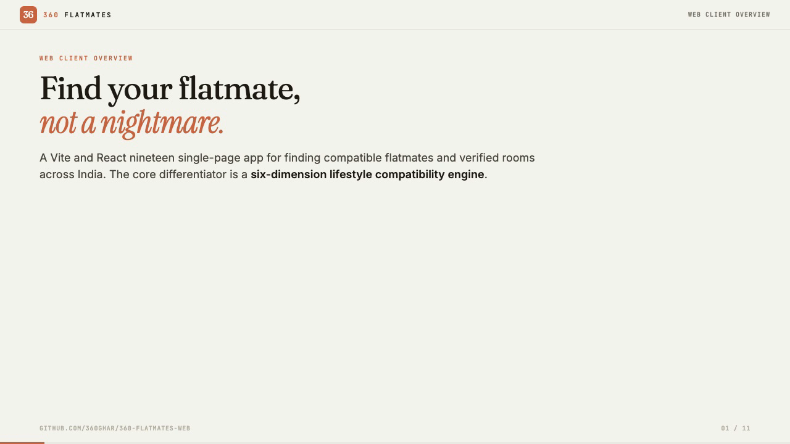

# 360 Flatmates Web

A modern web platform for finding compatible roommates and shared living spaces. Built with React, TypeScript, and Tailwind CSS.

## Overview

[](.wiki/video/overview.mp4)

*Click the poster to watch the full overview video (2:23)*

## Tech Stack

- **Framework**: Vite + React Router v7 (SPA, no SSR)
- **Language**: TypeScript (strict mode)
- **Styling**: Tailwind CSS v4 with custom design tokens
- **State**: Zustand (client) + TanStack React Query (server)
- **Auth**: Supabase (Phone OTP, Password, Google OAuth)
- **Real-time**: Supabase private Broadcast via backend bootstrap config
- **Maps**: Leaflet + React-Leaflet
- **Testing**: Vitest + React Testing Library (unit), Playwright (E2E)
- **API**: FastAPI backend at `/api/v1`

## Getting Started

```bash
npm install
cp .env.example .env   # fill in your keys
npm run dev             # http://localhost:5173
```

## Scripts

| Command | Description |
|---|---|
| `npm run dev` | Start Vite dev server |
| `npm run build` | TypeScript check + production build |
| `npm run lint` | ESLint check |
| `npm test` | Run Vitest unit tests |
| `npm run test:e2e` | Run Playwright E2E tests |
| `npm run typecheck` | TypeScript type checking only |

## Project Structure

```
360-flatmates-web/
├─ AGENTS.md
├─ CLAUDE.md
├─ DESIGN.md
├─ README.md
├─ index.html
├─ netlify.toml
├─ package.json
├─ playwright.config.ts
├─ postcss.config.mjs
├─ tsconfig.json
├─ vite.config.ts
├─ vitest.config.ts
├─ vitest.setup.ts
├─ docs/
│  └─ flatmates-openapi.yaml
├─ e2e/
│  ├─ app-navigation.spec.ts
│  ├─ auth-flow.spec.ts
│  ├─ auth-setup.ts
│  ├─ chat-flow.spec.ts
│  ├─ compatibility-flow.spec.ts
│  ├─ critical-flows.spec.ts
│  ├─ explore-flow.spec.ts
│  ├─ profile-interaction-flow.spec.ts
│  ├─ public-pages.spec.ts
│  ├─ search-flow.spec.ts
│  └─ visit-flow.spec.ts
├─ plans/
│  ├─ prd.md
│  └─ ui_ux.md
├─ public/
│  ├─ _redirects
│  ├─ llms.txt
│  ├─ robots.txt
│  ├─ sitemap.xml
│  ├─ fonts/
│  │  ├─ fonts.css
│  │  └─ screenshots/
│  └─ screenshots/
├─ scripts/
│  ├─ generate-favicon-ico.ts
│  ├─ generate-og-image.ts
│  ├─ generate-pwa-icons.ts
│  ├─ generate-sitemap.ts
│  ├─ generate-static-html.ts
│  ├─ prerender.ts
│  └─ lib/
│     ├─ blog-content.ts
│     ├─ listings.ts
│     └─ route-content.ts
├─ src/
│  ├─ App.tsx
│  ├─ entry.tsx
│  ├─ providers.tsx
│  ├─ test-utils.tsx
│  ├─ vite-env.d.ts
│  ├─ __mocks__/
│  │  └─ framer-motion.tsx
│  ├─ components/
│  │  ├─ ErrorBoundary.tsx
│  │  ├─ index.ts
│  │  ├─ analytics/
│  │  │  └─ Plausible.tsx
│  │  ├─ landing/
│  │  │  ├─ AppStoreBadges.tsx
│  │  │  ├─ BottomCTA.tsx
│  │  │  └─ ...
│  │  ├─ molecules/
│  │  ├─ onboarding/
│  │  ├─ organisms/
│  │  ├─ page-clients/
│  │  └─ ui/
│  ├─ hooks/
│  │  ├─ useAuth.ts
│  │  ├─ useCountUp.ts
│  │  ├─ useDirtyFormGuard.ts
│  │  ├─ useImageUpload.ts
│  │  ├─ useInView.ts
│  │  ├─ useKeyboardSwipe.ts
│  │  ├─ usePWA.ts
│  │  ├─ useResendTimer.ts
│  │  ├─ useScrollProgress.ts
│  │  ├─ useFlatmatesRealtime.ts
│  │  ├─ useRealtimeStatus.ts
│  │  ├─ useWebOtp.ts
│  │  └─ __tests__/
│  │     └─ queries/
│  ├─ lib/
│  │  ├─ config.ts
│  │  ├─ debug.ts
│  │  ├─ env.ts
│  │  ├─ image-utils.ts
│  │  ├─ lastAuthMethod.ts
│  │  ├─ prefetch.ts
│  │  ├─ redirect.ts
│  │  ├─ route-inventory.ts
│  │  ├─ __tests__/
│  │  ├─ api/
│  │  ├─ auth/
│  │  ├─ compatibility/
│  │  ├─ data/
│  │  ├─ push/
│  │  ├─ schemas/
│  │  ├─ seo/
│  │  ├─ storage/
│  │  ├─ stores/
│  │  ├─ supabase/
│  │  └─ utils/
│  ├─ pages/
│  │  ├─ ErrorFallback.tsx
│  │  ├─ guards.tsx
│  │  ├─ __tests__/
│  │  ├─ admin/
│  │  ├─ app/
│  │  ├─ auth/
│  │  └─ public/
│  └─ styles/
│     └─ globals.css
├─ tests/
│  └─ integration/
│     ├─ compatibility-engine.test.ts
│     ├─ query-keys.test.ts
│     └─ route-contracts.test.ts
└─ skills-lock.json
```

## Key Documents

- **DESIGN.md** — design tokens, component specs, visual targets
- **plans/prd.md** — product requirements and architecture
- **plans/ui_ux.md** — page and interaction specifications
- **docs/flatmates-openapi.yaml** — backend API contract

## Conventions

- Conventional commits: `feat:`, `fix:`, `refactor:`, `docs:`, `chore:`
- PascalCase components, camelCase hooks (`use*`)
- Co-located tests (`Component.test.tsx` or `__tests__/`)
- Dark mode: toggle via `data-theme="dark"` on `<html>`, default is light

## Environment Variables

See `.env.example` for all required variables:

| Variable | Purpose |
|---|---|
| `VITE_API_BASE_URL` | Backend API URL |
| `VITE_SUPABASE_URL` | Supabase project URL |
| `VITE_SUPABASE_PUBLISHABLE_KEY` | Supabase anon key |
| `VITE_GOOGLE_MAPS_API_KEY` | Google Maps / Geocoding |
| `VITE_VAPID_PUBLIC_KEY` | Web push notifications |

## Wiki

Comprehensive codebase documentation is available in the [GitHub Wiki](https://github.com/360ghar/360-flatmates-web/wiki). The wiki source lives in `.wiki/` and is auto-published to the GitHub Wiki on push to main via `.github/workflows/publish-wiki.yml`. To re-render the video overview after major changes, run `npm run wiki:render-video`.

## License

Private — all rights reserved.
